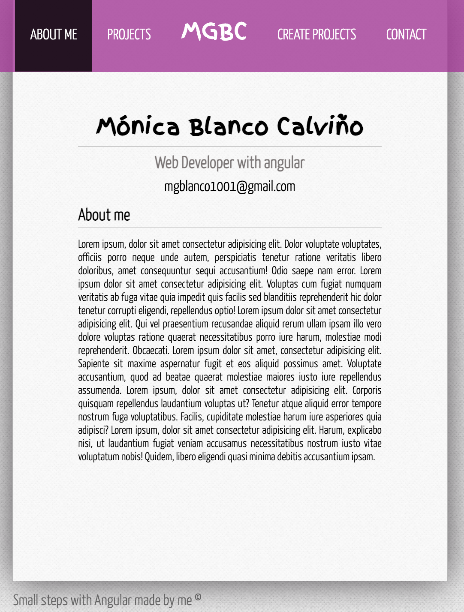
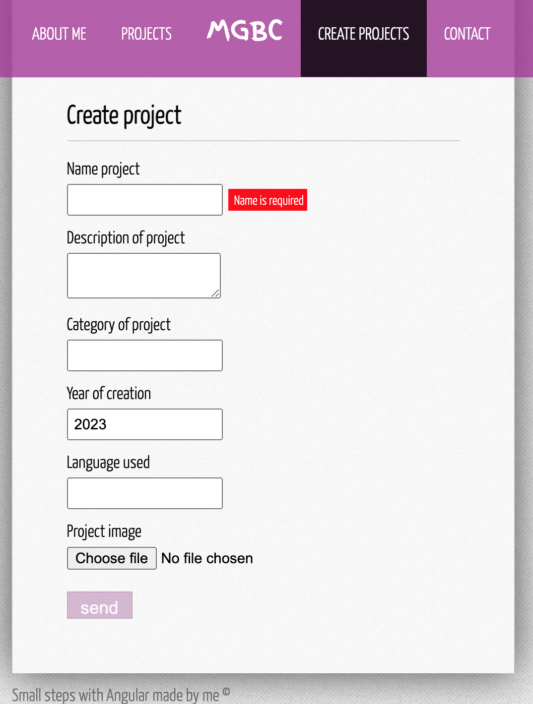
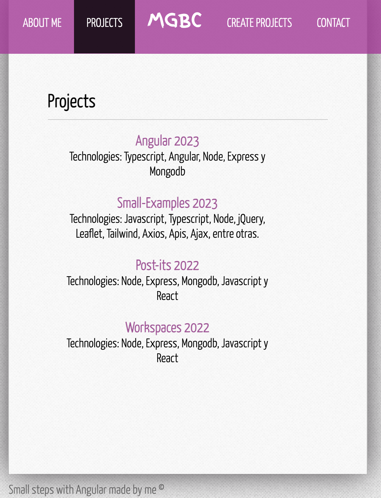
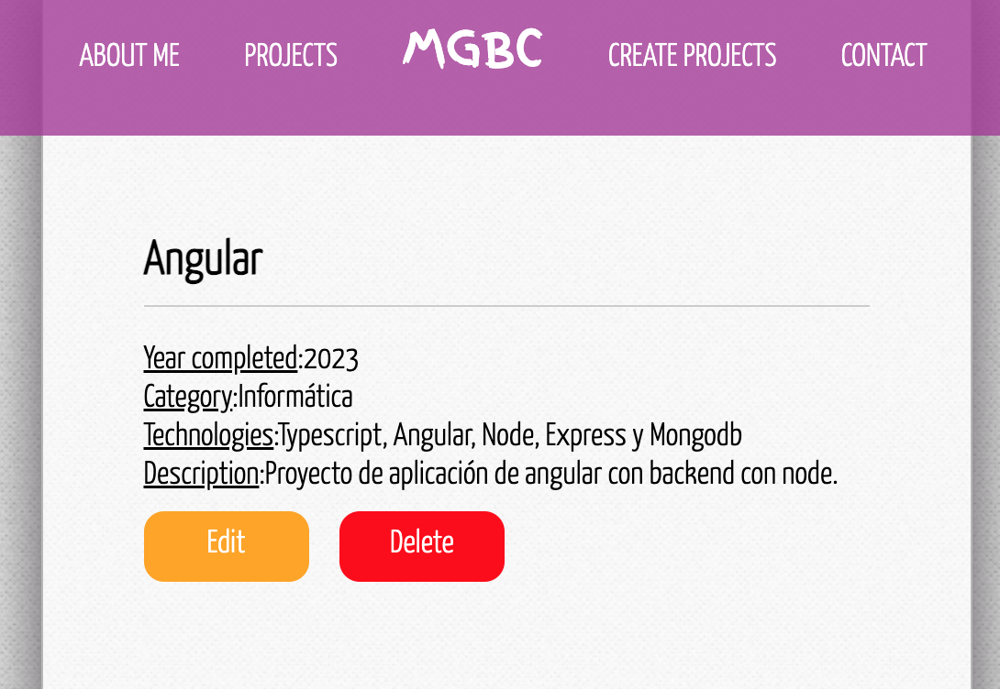
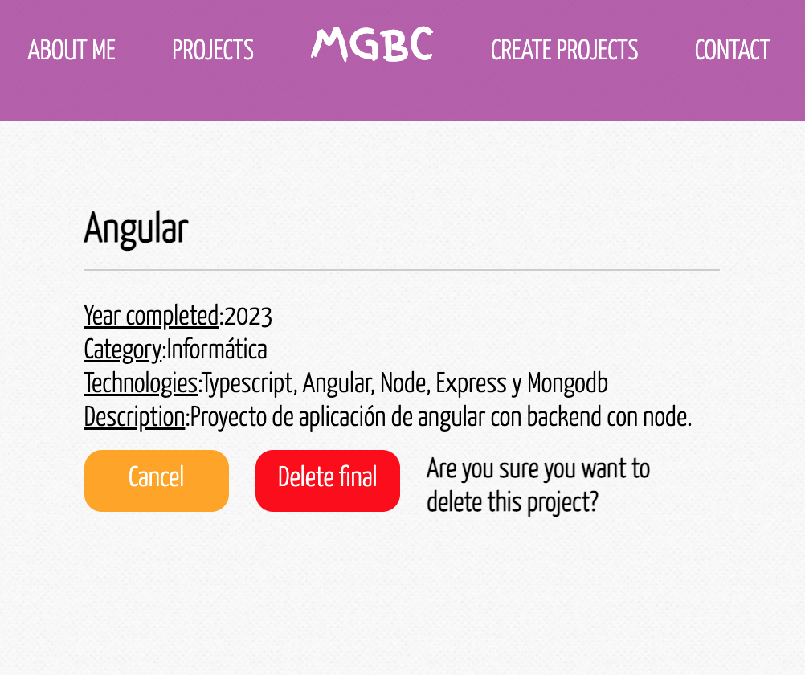

# ExamplesTypeScript
Essays, initiation and simple examples to learn typescript and angular.

# Functional Description
Save project application project made the frontend with angular and typescript and the backend with node, express and mongodb as database.

It is a simple application to save projects, after saving you can access them, see additional information, edit or delete if necessary.

When the project is saved, it is not allowed to save if any of the fields are missing and the user is informed through messages which fields are required to be able to save the messages.

Another peculiarity of the application is that the header menu indicates which section you are in, highlighting the color in it, and in the center of this menu there is a logo that makes an animation when the mouse is passed over it.

This web application is something very simple, simply to practice typescript and angular, that is why the backend of node was simply made with the 3-layer structure to make it as simple as possible and to be able to focus on the frontend, which is what was learning.

It has a Footer component that is used in all views of the application.

This project is made with the latest version of Angular cli (15.2.1), Angular (15.2.1) y Node (19.4.0).

## Images
#

